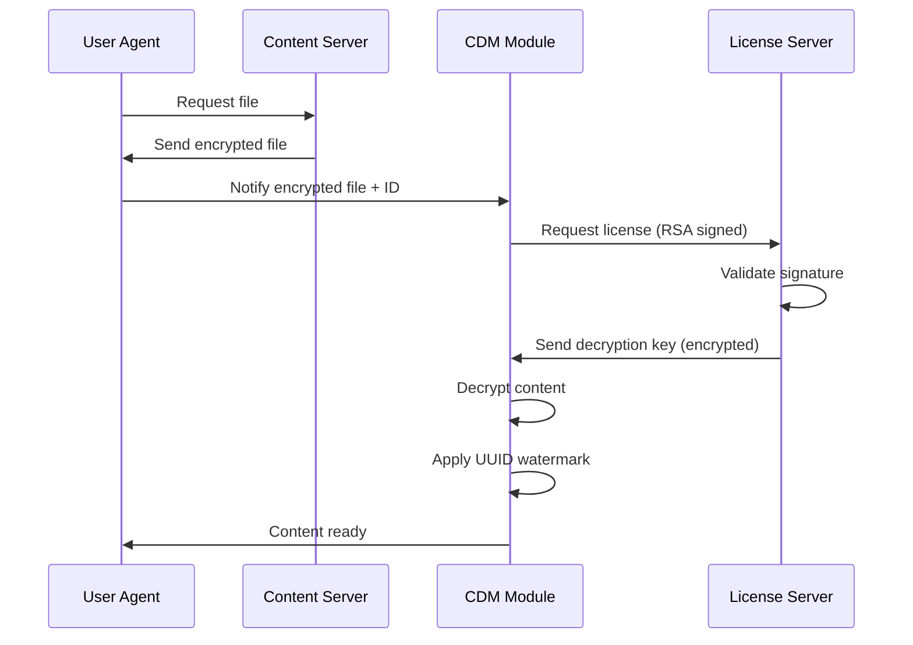
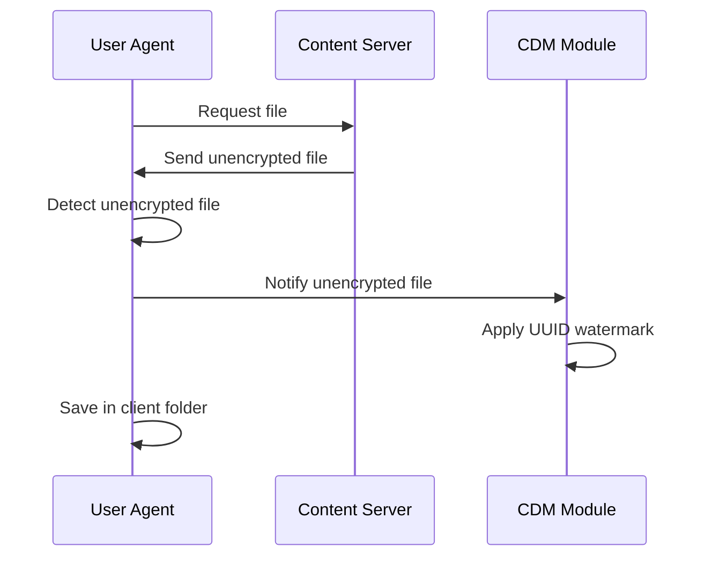

# DRM Content Protection System

Digital Rights Management (DRM) system implemented in Python that simulates a complete multimedia content protection ecosystem using advanced cryptographic techniques.

## Description

This project implements a functional DRM system that protects multimedia files (images, videos) through:

- **AES-256 encryption** for content protection
- **Secure key exchange with RSA** (1024 bits)
- Centralized **license server**
- **Content Decryption Module (CDM)** that simulates Widevine/PlayReady functionality
- **Dynamic watermarking** linked to the machine's unique identifier

## 🏗️ System Architecture

The system consists of four main components that communicate via TCP sockets:

```
┌─────────────────┐         ┌──────────────────┐
│   User Agent    │◄───────►│ Content          │
│     (UA.py)     │         │ Server           │
└────────┬────────┘         │ (Port 6001)      │
         │                  └──────────────────┘
         │                           
         │                  ┌──────────────────┐
         ├─────────────────►│ License          │
         │                  │ Server           │
         │                  │ (Port 7002)      │
         │                  └──────────────────┘
         │                           
         │                  ┌──────────────────┐
         └─────────────────►│ CDM Module       │
                            │ (Port 8003)      │
                            └──────────────────┘
```

### Components

#### 1. **User Agent (UA.py)** - Client
The user agent that requests and consumes protected content:
- Requests catalog of available content
- Downloads encrypted and unencrypted files
- Coordinates flow between servers
- Manages RSA keys for secure communication
- Automatically detects if a file is encrypted through file signatures

#### 2. **Content Server (Servidor_contenidos.py)**
Stores and distributes multimedia content:
- Serves catalog of available files (encrypted with AES)
- Sends encrypted and unencrypted content as appropriate
- Port: `6001`

#### 3. **License Server (Servidor_licencias.py)**
Centralized management of licenses and decryption keys:
- Validates RSA signatures of requests
- Distributes AES decryption keys specific to each file
- Stores keys in encrypted JSON (`c_claves_aes.json`)
- Implements secure key exchange via RSA
- Port: `7002`

#### 4. **Content Decryption Module - CDM (CDM.py)**
Decryption module similar to Widevine CDM:
- Decrypts protected content with keys obtained from the license server
- Applies watermark with the machine's UUID
- Saves decrypted content in the client folder
- Port: `8003`

#### 5. **Encryptor (cifrador.py)**
Auxiliary tool to prepare content:
- Encrypts files with AES-256
- Generates unique keys for each file
- Updates the key registry in JSON

## DRM Protection Flow

### Case 1: Encrypted File



### Case 2: Unencrypted File



## Implemented Security

### Symmetric Encryption (AES)
- **Algorithm**: AES-256 in CBC mode
- **Key size**: 256 bits (32 bytes)
- **Padding**: PKCS7
- **IV**: 16-byte initialization vector (should be random in production)
- **Usage**: 
  - Multimedia content protection
  - Server-client communication encryption
  - Key JSON file protection

### Asymmetric Encryption (RSA)
- **Key size**: 1024 bits
- **Usage**:
  - Secure AES key exchange between components
  - Digital signature of license requests (e=1783, n=3233)
  - Client identity validation

### Watermarking
- **Identifier**: Machine UUID (obtained via WMIC)
- **Technique**: Semi-transparent overlay with 45° rotation
- **Application**: Automatic in CDM for all decrypted content
- **Purpose**: Traceability and redistribution prevention

## Usage

### 1. Prepare Content (Optional)

If you want to encrypt new files:

```bash
python cifrador.py
# Enter the file name (e.g., image.jpg)
# Will generate encrypted c_image.jpg
```

### 2. Start Servers

Open **three terminals** and execute in order:

```bash
# Terminal 1 - Content Server
python Servidor_contenidos.py

# Terminal 2 - License Server
python Servidor_licencias.py

# Terminal 3 - CDM Module
python CDM.py
```

### 3. Run Client

```bash
# Terminal 4 - User Agent
python UA.py
```

### 4. Client Commands

```bash
# View catalog of available files
catalogo

# Request a specific file
leon.jpg

# Request encrypted file
c_leon.jpg

# Exit
quit
```

## Execution Example

```
 Write the file name or search for available ones (catalogo):
catalogo

Received message: 
 5s.mp4
burro.png
c_leon.jpg
...

Keep writing:
c_leon.jpg

c_leon.jpg received
The file is encrypted

Encrypted message  b'...'

Signature:  b'...'

Encrypted license key:  b'...'

Decrypted content saved
----------------------------------------
```

### Hardcoded Keys (For development)

**Content Server Key:**
```python
key = b'\xa9\x87\x1e\xdc\xc2\x3f\xb5\xb1\x9d\x4a\xee\x13\xc6\x92\x7a\xe5...'[:32]
```

**License JSON Key:**
```python
clave_json = b'\x0c4*A)\xb6\xc8\xf1\x12\xdf\xb3q\x1b\xb7)\xcc\xce...'
```

**RSA key pair for request signing:**
```python
clave_privada = (1783, 3233)  # (e, n)
clave_publica = (7, 3233)     # (d, n)
```

## 🔍 Supported File Signatures

The system automatically detects unencrypted files through these signatures:

- **PNG**: `\x89PNG\r\n\x1a\n`
- **JPEG/JPG**: `\xff\xd8\xff\xe0` or `\xff\xd8\xff\xe1`
- **MP4**: `ftypisom` or `ftypmp42`
- **MKV**: `\x1a\x45\xdf\xa3` or `EBML`
